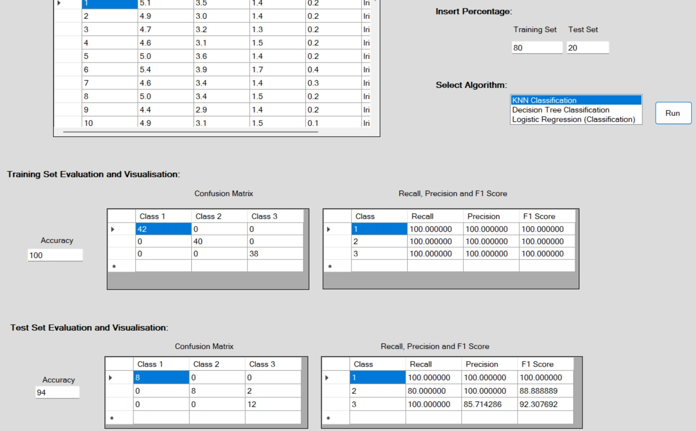
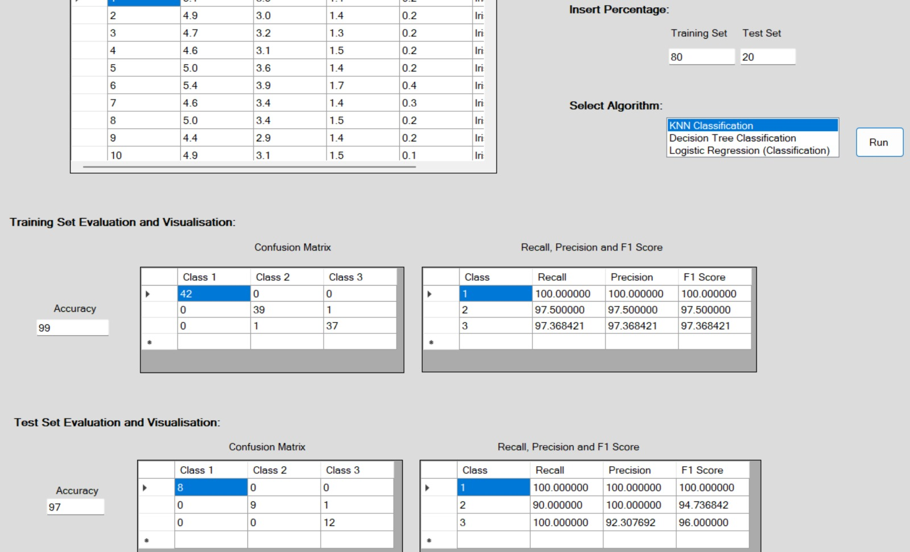
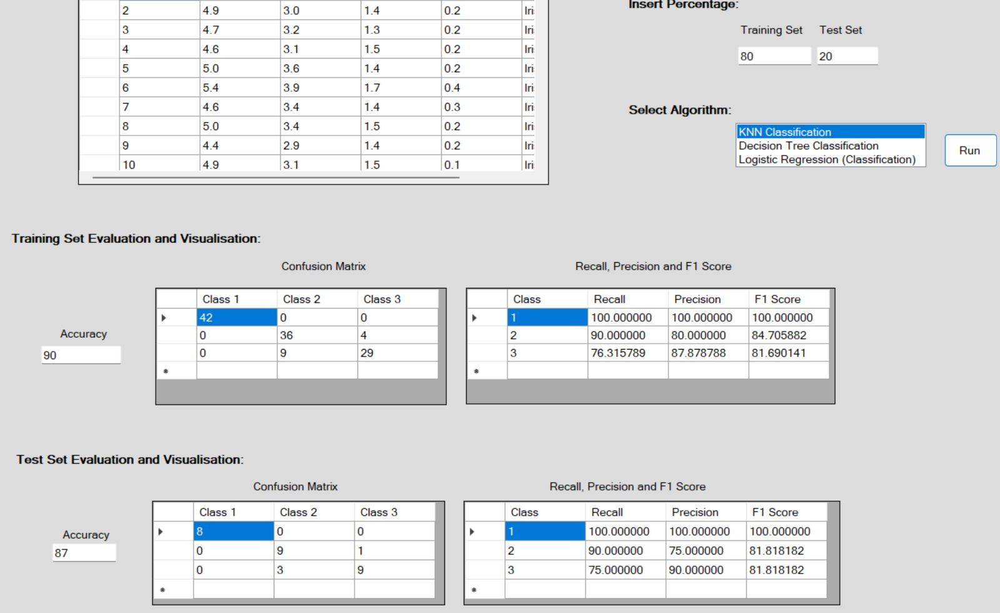
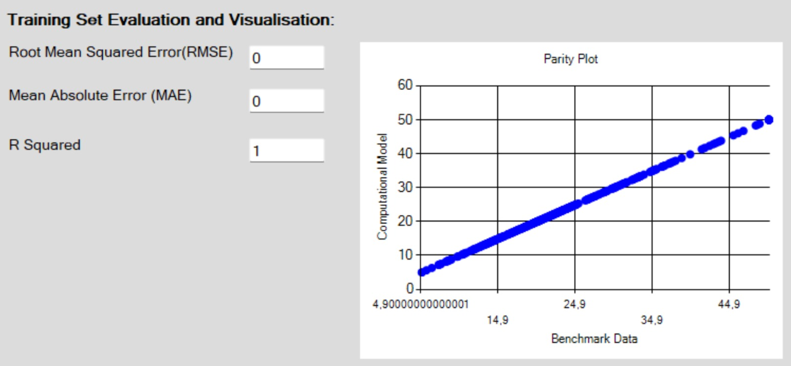
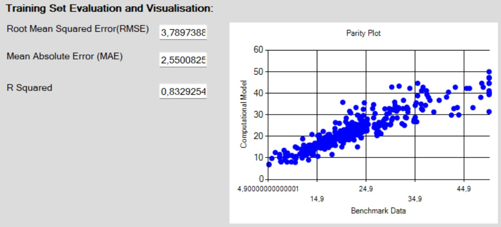
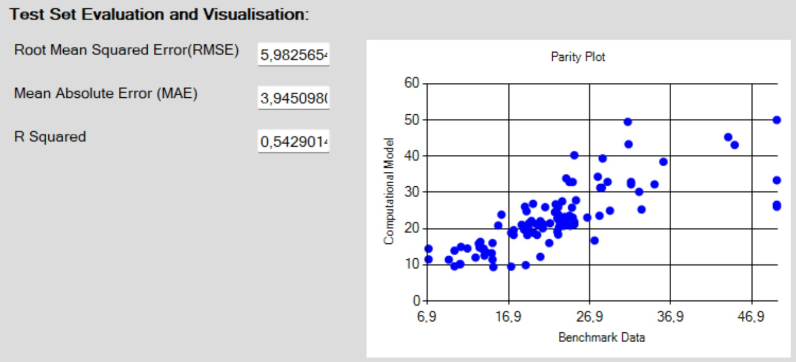
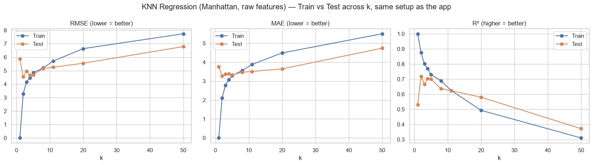

# Lab 1 report — k-NN Classification & Regression

Date: 2026-09-10, DVA262. Findings from Task 4 and Task 7 (k value
experimentation) — the task code itself lives in the actual source files
and `TODO.md`, not duplicated here.

## Task 4 — k-NN Classification (Iris)

Confusion matrices for k = 1, 5, 11 (≈ number of features × 2-3), 50:

| k=1 | k=5 |
|---|---|
|  |  |

| k=11 | k=50 |
|---|---|
|  |  |

**Conclusion: k=5 gave the best results** on this run.

## Task 7 — k-NN Regression (Boston Housing)

| k=1 (train) | k=3 (train) |
|---|---|
|  |  |

| k=5 | k=3 (test) |
|---|---|
|  |  |

R² recap across k values:

